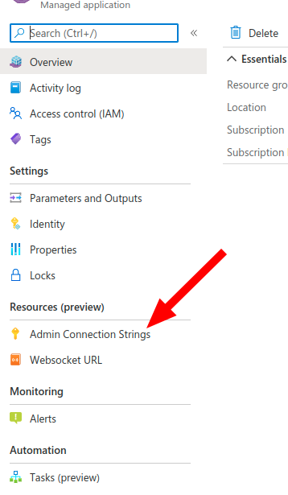

# REST API Reference

Ux4iot exposes a REST API that you can use in your security backend and in your own apps to manage subscription workflow. These APIs are used by ux4iot-react hooks to communicate with security backends and ux4iot.

We recommend using the [ux4iot-admin-node](https://github.com/deviceinsight/ux4iot-admin-node) library when using the REST API. At the moment, we only support typescript.

The only time you will need to directly use the ux4iot REST api is in your security backend to forward grants and in your DevOps to ensure the ux4iot is running correctly. All other resources are mainly used by the [ux4iot-react](https://github.com/deviceinsight/ux4iot-react) library.&#x20;

In order to use the REST API you will need the Shared-Access-Key of the Ux4iot. You can find it as part of the ux4iot connection string. Get the connection string by using the left sidebar in your ux4iot instance.



There are api resources to perform actions against the IoTHub. They are only available if you use an IoTHub service connection string in your ux4iot deployment parameters.

## Common

## Get the server version of ux4iot

<mark style="color:blue;">`GET`</mark> `https://ux4iot-xyz.westeurope.azurecontainer.io/version`

This resource can always be requested without any credentials.







## Get the current status of ux4iot

<mark style="color:blue;">`GET`</mark> `https://ux4iot-xyz.westeurope.azurecontainer.io/status`

Helpful when you want to ensure the correct deployment of ux4iot.



















## Set the log level of ux4iot

<mark style="color:orange;">`PUT`</mark> `https://ux4iot-xyz.westeurope.azurecontainer.io/logLevel/:level`

#### Path Parameters

| Name                                    | Type   | Description                                         |
| --------------------------------------- | ------ | --------------------------------------------------- |
| level<mark style="color:red;">\*</mark> | String | 'error' \| 'warn' \| 'info' \| 'verbose' \| 'debug' |

#### Headers

| Name                                                | Type   | Description |
| --------------------------------------------------- | ------ | ----------- |
| Shared-Access-Key<mark style="color:red;">\*</mark> | String |             |











## Sessions

## Opens a new session in ux4iot

<mark style="color:green;">`POST`</mark> `https://ux4iot-xyz.westeurope.azurecontainer.io/session`



```javascript
{
    sessionId: "string"
}
```



## Delete a session by ID

<mark style="color:red;">`DELETE`</mark> `https://ux4iot-xyz.westeurope.azurecontainer.io/sessions/:sessionId`

#### Path Parameters

| Name                                        | Type   | Description                     |
| ------------------------------------------- | ------ | ------------------------------- |
| sessionId<mark style="color:red;">\*</mark> | String | The ID of the session to delete |

#### Headers

| Name                                                | Type   | Description                                                                |
| --------------------------------------------------- | ------ | -------------------------------------------------------------------------- |
| Shared-Access-Key<mark style="color:red;">\*</mark> | String | The shared-access-key of the the connection string of your ux4iot instance |











## Delete all sessions

<mark style="color:red;">`DELETE`</mark> `https://ux4iot-xyz.westeurope.azurecontainer.io/sessions`

#### Headers

| Name                                                | Type   | Description                                                                |
| --------------------------------------------------- | ------ | -------------------------------------------------------------------------- |
| Shared-Access-Key<mark style="color:red;">\*</mark> | String | The shared-access-key of the the connection string of your ux4iot instance |











## Grants

Grants authorize a session to subscribe to resources, patch desired properties and execute direct methods.

### GrantRequest Types

GrantRequest types only differ in the "type" property. For Telemetry and DirectMethods you can add an additional property to restrict specific telemetry keys or direct methods respectively.


```typescript
type DeviceTwinGrantRequest = { sessionId: string; deviceId: string; type: 'deviceTwin'; }
type ConnectionStateGrantRequest = { sessionId: string; deviceId: string; type: 'connectionState'; }
type D2CMessageGrantRequest = { sessionId: string; deviceId: string; type: 'd2cMessages'; }
type DesiredPropertiesGrantRequest = { sessionId: string; deviceId: string; type: 'desiredProperties'; }
type TelemetryGrantRequest = {
  sessionId: string;
  deviceId: string;
  type: 'telemetry';
  telemetryKey: string | null;
}
type DirectMethodGrantRequest = {
  sessionId: string;
  deviceId: string;
  type: 'telemetry';
  directMethodName: string | null;
}
```


## Forward a grant

<mark style="color:orange;">`PUT`</mark> `https://ux4iot-xyz.westeurope.azurecontainer.io/grants`

Add a grant for the `sessionId` contained in the grant.

#### Headers

| Name                                                | Type   | Description                                   |
| --------------------------------------------------- | ------ | --------------------------------------------- |
| Shared-Access-Key<mark style="color:red;">\*</mark> | string | The Shared Access Key used for authentication |

#### Request Body

| Name                                        | Type           | Description                                                                                                                 |
| ------------------------------------------- | -------------- | --------------------------------------------------------------------------------------------------------------------------- |
| telemetryKey                                | string \| null | <p>available on type: "telemetry"</p><p>used to grant a specific telemetryKey. use null for all telemetry of the device</p> |
| deviceId<mark style="color:red;">\*</mark>  | string         | The IoT Hub device ID                                                                                                       |
| sessionId<mark style="color:red;">\*</mark> | string         | The sessionId for which the grant is requested                                                                              |
| type<mark style="color:red;">\*</mark>      | string         | 'telemetry' \| 'deviceTwin' \| 'connectionState' \| 'desiredProperties' \| 'directMethod' \| 'd2cMessages'                  |
| directMethodName                            | string         | available on type: 'directMethod' used to grant a specific directMethod. use null for all direct methods of the device      |



```
NO CONTENT
```



```
unknown grant type
```



```
Unauthorized: {error description}
```











## Revoke a grant

<mark style="color:red;">`DELETE`</mark> `https://ux4iot-xyz.westeurope.azurecontainer.io/grants`

Revoke the grant given&#x20;

#### Headers

| Name                                                | Type   | Description                                   |
| --------------------------------------------------- | ------ | --------------------------------------------- |
| Shared-Access-Key<mark style="color:red;">\*</mark> | string | The Shared Access Key used for authentication |

#### Request Body

| Name                                        | Type           | Description                                                                                                                 |
| ------------------------------------------- | -------------- | --------------------------------------------------------------------------------------------------------------------------- |
| deviceId<mark style="color:red;">\*</mark>  | string         | The device for which to revoke the grant                                                                                    |
| type<mark style="color:red;">\*</mark>      | string         | The grant type to revoke                                                                                                    |
| sessionId<mark style="color:red;">\*</mark> | string         | The session ID that the grant belongs to                                                                                    |
| telemetryKey                                | string \| null | <p>available on type: "telemetry"</p><p>used to grant a specific telemetryKey. use null for all telemetry of the device</p> |
| directMethodName                            | string \| null | available on type: 'directMethod' used to grant a specific directMethod. use null for all direct methods of the device      |



```
```



















## Subscriptions

A subscription request lets a session subscribe to live data from the EventHub. Similar to GrantRequests, there are multiple SubscriptionRequest types:


```typescript
export type TelemetrySubscriptionRequest = {
  sessionId: string;
  deviceId: string;
  type: 'telemetry';
  telemetryKey: string | null; 
};
export type DeviceTwinSubscriptionRequest = { sessionId: string; deviceId: string; type: 'deviceTwin'; };
export type ConnectionStateSubscriptionRequest = { sessionId: string; deviceId: string; type: 'connectionState'; };
export type D2CMessageSubscriptionRequest = { sessionId: string; deviceId: string; type: 'd2cMessages'; };
```


## Subscribe to live data

<mark style="color:orange;">`PUT`</mark> `https://ux4iot-xyz.westeurope.azurecontainer.io/subscription`

#### Request Body

| Name                                        | Type           | Description                                                                                |
| ------------------------------------------- | -------------- | ------------------------------------------------------------------------------------------ |
| sessionId<mark style="color:red;">\*</mark> | string         |                                                                                            |
| deviceId<mark style="color:red;">\*</mark>  | string         |                                                                                            |
| type<mark style="color:red;">\*</mark>      | string         | one of 'telemetry' \| 'deviceTwin' \| 'connectionState' \| 'd2cMessages'                   |
| telemetryKey                                | string \| null | Only available on type: "telemetry". use null for subscribing to all telemetry of a device |



















## Unsubscribe from live data

<mark style="color:red;">`DELETE`</mark> `https://ux4iot-xyz.westeurope.azurecontainer.io/subscription`

#### Request Body

| Name                                        | Type           | Description                                                                                |
| ------------------------------------------- | -------------- | ------------------------------------------------------------------------------------------ |
| sessionId<mark style="color:red;">\*</mark> | string         |                                                                                            |
| deviceId<mark style="color:red;">\*</mark>  | string         |                                                                                            |
| type<mark style="color:red;">\*</mark>      | string         | one of 'telemetry' \| 'deviceTwin' \| 'connectionState' \| 'd2cMessages'                   |
| telemetryKey                                | string \| null | Only available on type: "telemetry". use null for subscribing to all telemetry of a device |



















## Bulk subscribe to multiple devices

<mark style="color:orange;">`PUT`</mark> `https://ux4iot-xyz.westeurope.azurecontainer.io/subscriptions`

You have to send a list of subscription requests as body. If this list contains an invalid subscription request, the entire request will fail without applying any subscription requests. If you have a missing grant for some of the subscription requests, they will be skipped.

The response will contain a body that gives you the list of applied subscription requests. If you have valid grants for all subscription requests, the response body will match your request body.&#x20;











## Bulk unsubscribe from multiple devices

<mark style="color:red;">`DELETE`</mark> `https://ux4iot-xyz.westeurope.azurecontainer.io/subscriptions`

You have to send a list of subscription requests as body. If this list contains an invalid subscription request, the entire request will fail without removing any subscription requests. If you have a missing grant for some of the subscription requests, they will be skipped.

The response will contain a body that gives you the list of applied subscription requests. If you have valid grants for all subscription requests, the response body will match your request body.&#x20;











## Last Values

## Read last telemetry values for device

<mark style="color:blue;">`GET`</mark> `https://ux4iot-xyz.westeurope.azurecontainer.io/lastValue/:deviceId/:telemetryKey?`

This endpoint both supports requests with sessionId header or requests with Shared-Access-Key header.

If you use a sessionId, then it will be check whether a grant for the device telemetry exists before the last values are returned.

If you use a Shared-Access-Key, then any last value will be returned, without grants being checked.

#### Path Parameters

| Name                                       | Type   | Description                                       |
| ------------------------------------------ | ------ | ------------------------------------------------- |
| deviceId<mark style="color:red;">\*</mark> | String |                                                   |
| telemetryKey                               | String | if omitted, returns all last values of the device |



<pre class="language-typescript"><code class="lang-typescript"><strong>// telemetryKey provided
</strong><strong>{ 
</strong>  deviceId: string;
  data: {
    [telemetryKey]: any;
  }
  timestamp: string; // iso date
}

// telemetryKey not provided
{
  deviceId: string;
  data: {
    [telemetryKey]: {
      value: any;
      timestamp: string; // iso date
    }
  }
  timestamp: '';
}
</code></pre>

























## Remove all last values for a device

<mark style="color:red;">`DELETE`</mark> `https://ux4iot-xyz.westeurope.azurecontainer.io/lastValue/:deviceId`

This endpoint both supports requests with sessionId header or requests with Shared-Access-Key header.

If you use a sessionId, then it will be check whether a grant for the device telemetry exists before the last values are returned.

If you use a Shared-Access-Key, then any last value will be returned, without grants being checked.

#### Path Parameters

| Name                                       | Type   | Description                                       |
| ------------------------------------------ | ------ | ------------------------------------------------- |
| deviceId<mark style="color:red;">\*</mark> | String |                                                   |
| telemetryKey                               | String | if omitted, returns all last values of the device |



<pre class="language-typescript"><code class="lang-typescript"><strong>// telemetryKey provided
</strong><strong>{ 
</strong>  deviceId: string;
  data: {
    [telemetryKey]: any;
  }
  timestamp: string; // iso date
}

// telemetryKey not provided
{
  deviceId: string;
  data: {
    [telemetryKey]: {
      value: any;
      timestamp: string; // iso date
    }
  }
  timestamp: '';
}
</code></pre>





















## Read last device twin for device

<mark style="color:blue;">`GET`</mark> `https://ux4iot-xyz.westeurope.azurecontainer.io/deviceTwin/:deviceId`

Returns the last device twin for a device, if you have provided a IoTHub service connection string in your ux4iot deployment parameters.

#### Path Parameters

| Name                                       | Type   | Description |
| ------------------------------------------ | ------ | ----------- |
| deviceId<mark style="color:red;">\*</mark> | string |             |



<pre class="language-typescript"><code class="lang-typescript"><strong>{
</strong>  deviceId,
  data: DeviceTwin
  timestamp: string // iso date
}
</code></pre>























## Read last connection state for device

<mark style="color:blue;">`GET`</mark> `https://ux4iot-xyz.westeurope.azurecontainer.io/connectionState/:deviceId`

Returns the last connection state for a device.

If you have provided a IoTHub service connection string in your ux4iot deployment parameters and if there is no connection state found in the ux4iot's cache, ux4iot will also check the IoTHub for the connected property in the device twin for a last connection state.

[Read more about the connection state concept here](concepts.md)

#### Path Parameters

| Name                                       | Type   | Description |
| ------------------------------------------ | ------ | ----------- |
| deviceId<mark style="color:red;">\*</mark> | string |             |



<pre class="language-typescript"><code class="lang-typescript"><strong>{
</strong>  deviceId,
  data: DeviceTwin
  timestamp: string // iso date
}
</code></pre>























## IoTHub Methods

These api resources are only available if you provided an IoTHub service connection string in your ux4iot deployment parameters.

### Direct Method

We use the IoTHub parameters that you will need to send in the direct method request:


```typescript
type DirectMethodRequestBody = { 
  deviceId: string; 
  methodParams: {
    // The name of the method to call on the device.
    methodName: string;
    // The method payload that will be sent to the device.
    payload?: any;
    // The maximum time a device should take to respond to the method.
    responseTimeoutInSeconds?: number;
    // The maximum time the service should try to connect to the device before declaring the device is unreachable.
    connectTimeoutInSeconds?: number;
  }
}
```


When authorized and grants are set, ux4iot will send a request to IoTHub to execute the requested direct method. We forward the [HTTP response codes from the IoTHub](https://learn.microsoft.com/en-us/azure/iot-hub/iot-hub-devguide-direct-methods#response).

## Executes a direct method on an IoTHub device

<mark style="color:green;">`POST`</mark> `https://ux4iot-xyz.westeurope.azurecontainer.io/directMethod`

Provide a body containing the following

#### Request Body

| Name                                           | Type               | Description |
| ---------------------------------------------- | ------------------ | ----------- |
| deviceId<mark style="color:red;">\*</mark>     | String             |             |
| methodParams<mark style="color:red;">\*</mark> | DeviceMethodParams |             |



<pre class="language-json"><code class="lang-json"><strong>{
</strong>    "status" : 201,
    "payload" : {...}
}
</code></pre>























### Patch Desired Properties

Apply a patch to desired properties of a device using the following request body:

```typescript
type PatchDesiredPropertiesRequestBody = { 
  deviceId: string;
  desiredPropertyPatch: Record<string, any>
}
```

## Executes a patch of desired properties on a device twin

<mark style="color:purple;">`PATCH`</mark> `https://ux4iot-xyz.westeurope.azurecontainer.io/deviceTwinDesiredProperties`

#### Request Body

| Name                                                   | Type                 | Description |
| ------------------------------------------------------ | -------------------- | ----------- |
| deviceId<mark style="color:red;">\*</mark>             | String               |             |
| desiredPropertyPatch<mark style="color:red;">\*</mark> | Record\<string, any> |             |



















```
{
   status: number;
   payload: Record<string, any>;
}
```


