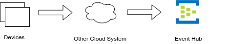

# Using a separate Event Hub

In addition to the built-in Event Hub of your IoT Hub you can use a separate Event Hub as well.

## Scenario 1

An Event Hub receives messages from IoT Hub through [message routing](https://docs.microsoft.com/en-us/azure/iot-hub/iot-hub-devguide-messages-d2c) or via an Azure Function transformation.


## Scenario 2

It's also possible that you do not use an IoT Hub at all, but send messages to the Event Hub by other means. For example when devices communicate via a legacy protocol not supported by IoT Hub. There is a custom protocol endpoint, e.g. realized using an Azure Function, that the devices connect to.


## Scenario 3

Data is received not from devices directly but via some other cloud.



## Using ux4iot with Event Hubs

In Scenario 1 all hooks can be used. You only need to configure ux4iot with the connection string of the Event Hub instead of the connection string of the Event Hub compatible endpoint of IoT Hub. In scenario 2 and 3, which do not include an IoT Hub at all, the following hooks can be used:

* [useTelemetry](../using-react/hooks.md#usetelemetry)
* [useMultiTelemetry](../using-react/hooks.md#usemultitelemetry)
* [useD2CMessages](../using-react/hooks.md#used-2-cmessages)

When you send messages to Event Hub, they must adhere to the following requirements:

* They must have a property `iothub-connection-device-id` containing the device identifier
* They must have a property `iothub-message-schema`. The value of this property must be `Telemetry`.


If you send the messages from IoT Hub through message routing, these properties are automatically set.


Here is an example of sending a message to an Event Hub using Node.js:

```javascript
const { EventHubProducerClient } = require("@azure/event-hubs");

const eventHubName = "ux4iot-input";

const {
    EVENT_HUB_CONNECTION_STRING
} = process.env;

function getRandomInt(max) {
  return Math.floor(Math.random() * Math.floor(max));
}

async function main() {

    // Create a producer client to send messages to the event hub.
    const producer = new EventHubProducerClient(EVENT_HUB_CONNECTION_STRING, eventHubName);

    const now = new Date();

    const body = {
        temperature: 42.1,
        pressure: 10.9,
        timestamp: now.toISOString()
    };

    const properties = {
        "iothub-connection-device-id": "some-device",
        "iothub-message-schema": "Telemetry" 
    };

    const batch = await producer.createBatch();
    batch.tryAdd({ body, properties });

    await producer.sendBatch(batch);
    await producer.close();
}

main().catch((err) => {
    console.log("An error occurred: ", err);
})
```

